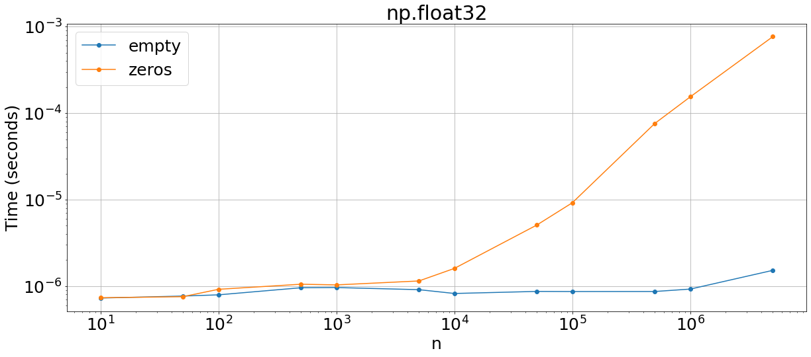

## `np.empty` or `np.zeros`?

Do we gain something by "initializing" with `np.empty` instead of `np.zeros`?


```python
import numpy as np
from plot_machinery.plot import data, kernel, plot, repeat_count, clear_kernels
```


```python
clear_kernels()


@kernel()
def empty(n, dtype):
    return np.empty(n, dtype=dtype)


@kernel()
def zeros(n, dtype):
    return np.zeros(n, dtype=dtype)
```


```python
@data(
    steps=[10, 50, 100, 500, 1000, 5000, 10000, 50000, 100000, 500000, 1000000, 5000000]
)
def data_gen(step):
    return (step, int)


plot(logx=True, logy=True, xlabel="n", title="Int")
```


    

    


```python
@data(
    steps=[10, 50, 100, 500, 1000, 5000, 10000, 50000, 100000, 500000, 1000000, 5000000]
)
def data_gen(step):
    return (step, np.float32)


plot(logx=True, logy=True, xlabel="n", title="np.float32")
```


    

    


```python
@data(
    steps=[10, 50, 100, 500, 1000, 5000, 10000, 50000, 100000, 500000, 1000000, 5000000]
)
def data_gen(step):
    return (step, np.float64)


plot(logx=True, logy=True, xlabel="n", title="np.float64")
```


    

    

